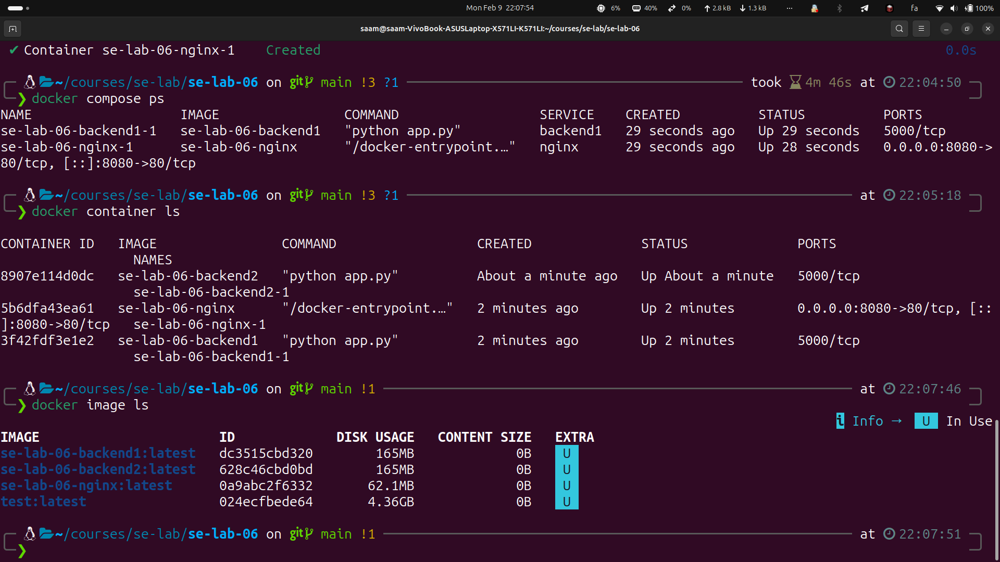
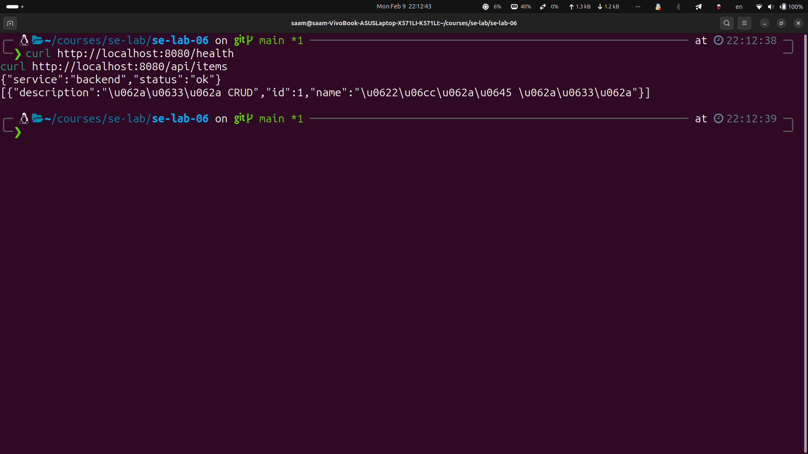
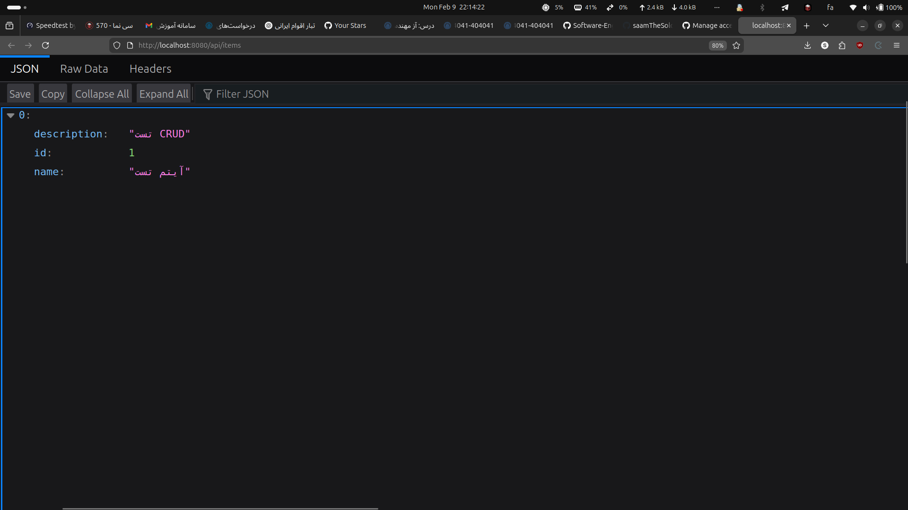

# استقرار نرم‌افزار با معماری MicroService به کمک Docker

## ساختار پروژه

- **backend**: سرویس RESTful API با عملیات CRUD (Flask + SQLite)
- **nginx**: Load Balancer با الگوریتم least_conn
- **پایگاه‌داده مشترک**: SQLite در volume مشترک بین backend1، backend2 و backend3

## نحوه اجرا

```bash
docker compose up --build -d
```

API روی پورت 8080 در دسترس است: http://localhost:8080

---

## گزارش آزمایش

### ۱. Build و اجرا با Docker Compose


### ۲. خروجی docker image ls



### ۳. نمایش اجرای موفق API در مرورگر یا Postman

**بررسی سلامت سرویس (health endpoint):**



**دریافت لیست آیتم‌ها (api/items):**



**Endpoint‌های API:**

| متد | آدرس | توضیح |
|-----|------|-------|
| GET | http://localhost:8080/health | بررسی سلامت سرویس |
| GET | http://localhost:8080/api/items | لیست همه آیتم‌ها |
| GET | http://localhost:8080/api/items/1 | دریافت آیتم با شناسه |
| POST | http://localhost:8080/api/items | ایجاد آیتم (body: `{"name":"نام","description":"توضیح"}`) |
| PUT | http://localhost:8080/api/items/1 | بروزرسانی آیتم |
| DELETE | http://localhost:8080/api/items/1 | حذف آیتم |

**تست سریع در ترمینال:**
```bash
curl http://localhost:8080/health
curl http://localhost:8080/api/items
```

### ۴. Scale کردن backend (کنترل فشار روی سرویس‌ها)

با افزایش فشار روی backend، یک نمونه دیگر (backend3) اضافه شد تا بار بین سرویس‌ها توزیع شود:

- **تغییر در docker-compose.yml**: اضافه شدن سرویس backend3
- **تغییر در nginx.conf**: اضافه شدن backend3 به upstream

پایگاه‌داده همچنان مشترک است و قادر به تحمل بار است؛ فقط سرویس‌های backend scale شده‌اند.

```bash
docker compose up -d --build
docker compose ps
```

برای اطمینان، خروجی `docker compose ps` با ۳ backend در حال اجرا قابل مشاهده است.

---

## پرسش‌ها

### ۱. مفهوم stateless به چه معناست؟ ما چه استفاده‌ای از این مفهوم در آزمایش خود کرده‌ایم؟

**مفهوم stateless (بدون حالت):** به سرویسی گفته می‌شود که هیچ اطلاعات وضعیت (state) مربوط به درخواست‌های قبلیِ کلاینت را در حافظهٔ خود نگه نمی‌دارد. هر درخواست به‌صورت مستقل و کامل پردازش می‌شود و سرویس برای پاسخ به آن نیازی به اطلاعات جلسهٔ قبلی ندارد.

**استفاده در این آزمایش:**
- سرویس‌های backend ما **stateless** هستند؛ هر درخواست HTTP شامل تمام اطلاعات لازم برای پردازش است و هیچ وضعیت جلسه‌ای روی خود backend ذخیره نمی‌شود.
- به همین دلیل **Load Balancing** امکان‌پذیر است: چون هر backend نمونه یکسان رفتار می‌کند، Nginx می‌تواند هر درخواست را به هر یک از backend1، backend2 یا backend3 هدایت کند.
- داده‌ها در **پایگاه‌داده مشترک** ذخیره می‌شوند، نه در حافظهٔ فرآیند backend؛ بنابراین هر نمونه backend می‌تواند همان عملیات را انجام دهد و نتیجهٔ یکسانی تولید کند.
- این امر باعث می‌شود **scale کردن** ساده باشد: با اضافه کردن backend3، نیازی به sticky session یا مبدّل‌های پیچیده نیست؛ همهٔ نمونه‌ها قابل تعویض هستند.
